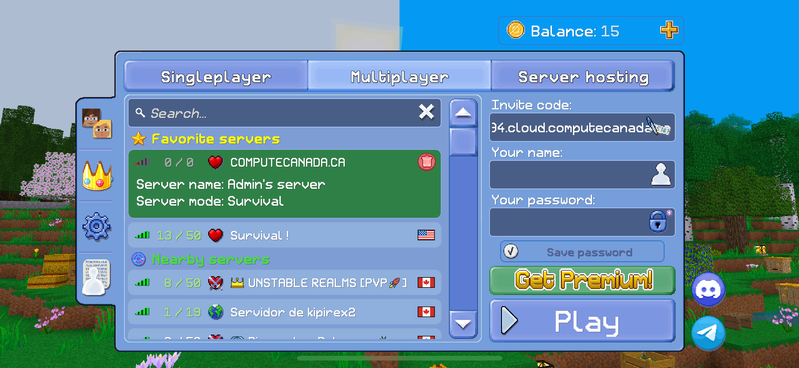
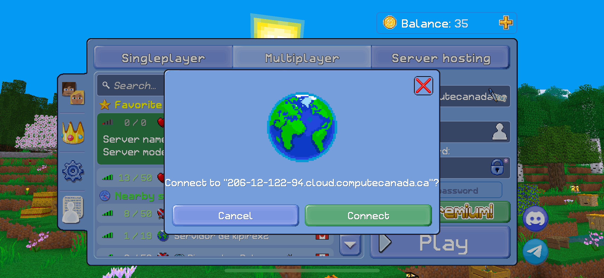
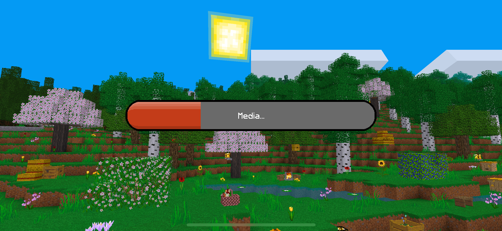
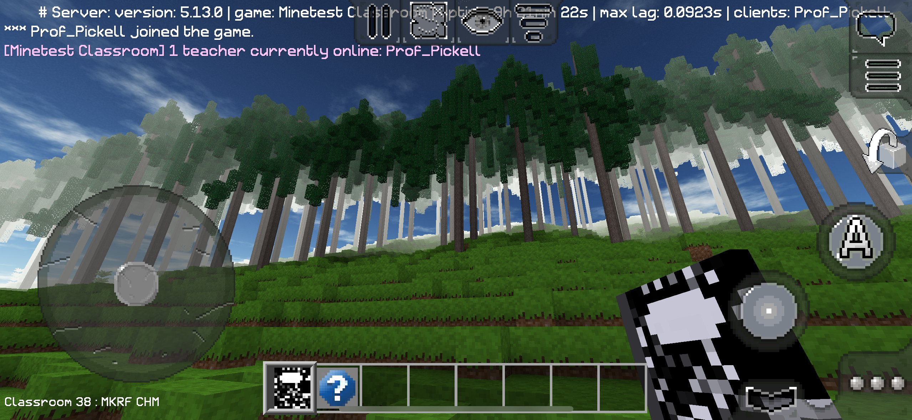
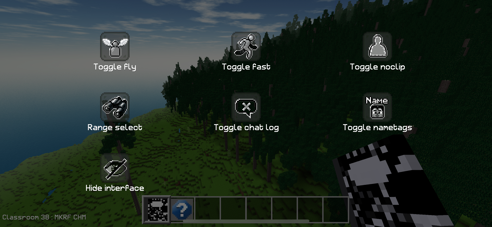

# Join the Multicraft Server

This page will help you join and play our remote Multicraft world.

------------------------------------------------------------------------

## Step 1 — Install the app

### [iOS](https://apps.apple.com/us/app/multicraft-build-and-mine/id1174039276) (\~119 MB)

### [Android](https://play.google.com/store/apps/details?id=com.multicraft.game&hl=en) (\~55 MB)

------------------------------------------------------------------------

## Step 2 — Join the server

Open the Multicraft app and:

-   Tap **"Multiplayer"**
-   Copy the server address below and paste it into **"Invite Code"**

``` md
206-12-122-94.cloud.computecanada.ca:30000
```



-   Enter a name for your player
-   Enter a password
-   Tap "**Play"**
-   You may be shown some advertisements, then you will be prompted to connect to the server and re-enter your password, then click **"Connect"**



-   Wait for the game assets **(\~78 MB)** to download automatically to your device before you can play



------------------------------------------------------------------------

# Play the server

When you arrive in the multiplayer game, you will see a forest.



The forest and the ground are generated from a laser scan (LiDAR) at UBC's Maclolm Knapp Research Forest in Canada. The game shows visualizations of the 3D point cloud that have been voxelized to approximately 1 cubic meter using different attributes from the laser scan. The first world shows the classification codes of the laser scan, where the ground returns have been interpolated into a continuous digital elevation model using inverse distance weighting and the tree stems have been proceedurally produced using a maximum height filter on a canopy height model.

You can pan around with the game pad on the right and move your character along the horizontal plane with the game pad on the left.

The A button does nothing.

**To jump/fly:** tap grey button below A to jump, holding it will make you fly up, double tapping it will toggle on/off fly mode.

**To fly down:** hold the down-ward pointing arrow button below the grey button.

Pressing the three horizontal bars at the top of the screen allows you to toggle different abilities, including fly and fast. You can also select "Range select" here to increase how far you can see in the game world.



The tool that you are wielding is the Student Notebook. Press and hold somewhere on your screen that is not a button to open it. It is not formatted with mobile gaming in mind, sorry! Click **"Classrooms"** to view the other worlds that you can teleport to. Most of these are examples of the same laser scanned forest, but different attributes like point density, scan angle, intensity, and a version where we have colorized the laser scan using an orthophoto from the same date. The other options in the Student Notebook can be explored more easily in a desktop environment with Multicraft or Luanti software. Click the little x in the top left to close the student notebook.

**To exit:** press the two vertical bars at the top and select **"Exit to main menu"**.

Enjoy!


